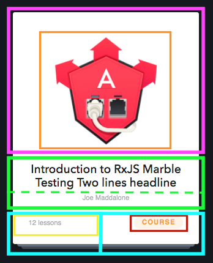
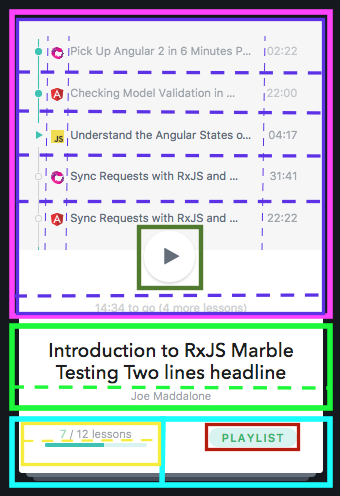
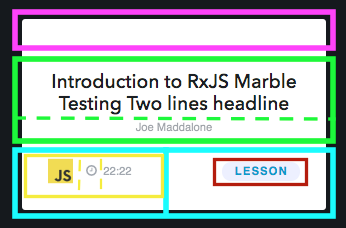

# 03. Planning Our Components

In order to form our plan of attack, let's do the component hierarchy excercise featured in Facebook's ["Thinking in React"](https://facebook.github.io/react/docs/thinking-in-react.html) article. This exercise is useful not only to help you visualize how your components fit together, but also to help you come up with names for the subcomponents.

This can be done with any software that allows you to annotate an image (I'm using Preview, that ships by default in Mac OS).

The first step is to [break each card into common parts](./allcards.png), and then drill down from there. Each Card has the same basic attributes (e.g. white background, rounded corners), and will have its sections annotated in different colors. In this case, I'm using neon pink for the card's header, neon green for the body, and neon blue for the footer.

## Card Header (Neon Pink)
In our Lesson Card, the header is empty, so no subcomponent will be needed. Our Course Card has an image, so we know we will need a component for that. I've highlighted it in orange.

Our Playlist Card has a lot going on, and will need to host an entire set of subcomponents. Let's take a closer look.

#### Playlist Component
I've drawn a purple square around the area inside the header that the playlist will take up. Examining the inside of the playlist, I can see several line items, each representing a video in the list. I know that we will need subcomponents for each of these, so I'll separate them with a dashed purple line. Now that we can see them sliced horizontally, we have different vertical lines to draw as well, separating the playlist status icon, a language type icon, the video's name, and the video length.

Below the Playlist Entries, we have the `PlayButton` component outlined in dark green, even though we've already created it.

Finally, underneath the `PlayButton` we have a summary of the remaining time in the playlist.

### CardHeader Component Tree
It can be helpful to look at the hierarchy as a tree. We'll revisit this as we build out the subcomponents.

* `CardHeader`
  - `HeaderImage`
  - `Playlist`
    - `PlaylistItem`
      - `PlayedStatus` (conditional classes on the `<li>`)
      - `CategoryIcon`
      - `VideoTitle`
      - `VideoLength`
    - `PlayButton`
    - `PlaylistSummary`

## Card Body (Neon Green)
The body of the card is simple, and contains two subcomponents: a title, and the author.

### CardBody Component Tree
* `CardBody`
  - `CardTitle`
  - `CardAuthor`

## Card Footer (Neon Blue)
The footer is split between an indicator of the type of material the card represents, and statistics or metadata about the material-- such as number of videos and length.

#### MaterialType Component
Outlined in maroon, the `MaterialType` features a pill with different styling applied depending on if the material is a course, lesson, or a playlist.

#### MaterialMeta Component
The metadata for the material has been sliced into subcomponents by yellow lines, and again, presentation depends upon the type of material.

### CardFooter Component Tree
* `CardFooter`
  - `MaterialType`
  - `MaterialMeta`
    - `LessonCount`
    - `CompletedLessonCount`
    - `ProgressBar`
    - `LessonLength`
    - `LessonTypeIcon`

## Next Step
Now that we have a plan of attack for our component hierarchy, we can start on implementing our reusable `Card` component.
